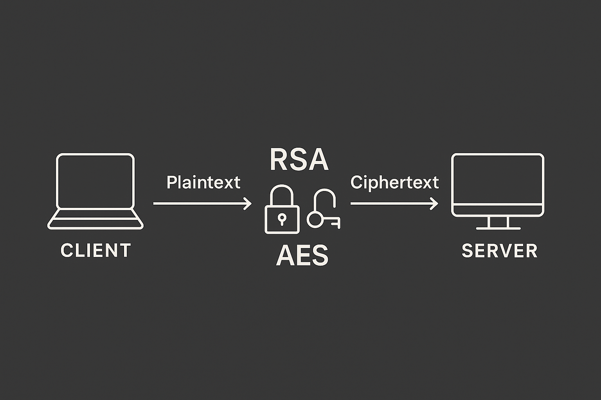
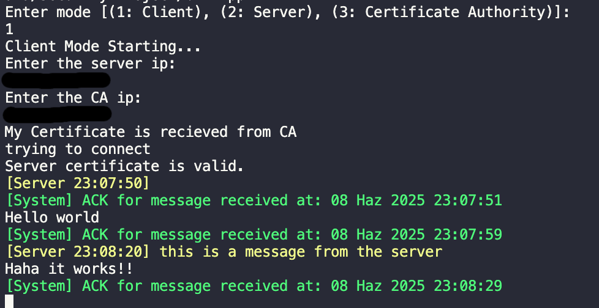
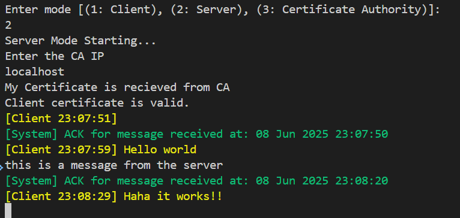
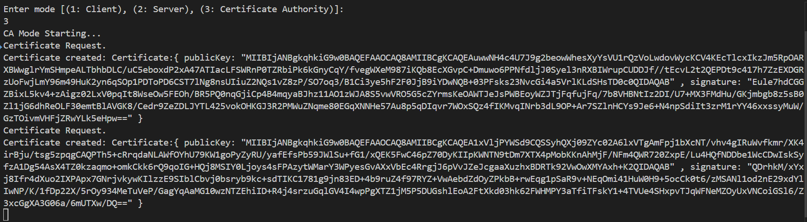

# 🔒 Secure Communication System



## Overview

Welcome to our Secure Communication System!  
This project implements a robust, real-world inspired secure end-to-end encrypted messaging platform with three main modes:

- **Client** 🧑‍💻
- **Server** 🖥️
- **Certificate Authority (CA)** 🏛️

Our system uses modern cryptography standards to ensure **confidentiality**, **authentication**, and **integrity** for all communications.

---

## 🚀 Features

- **Three Modes:**

  - **Client:** Connects to the server and CA, sends/receives secure messages and files.
  - **Server:** Handles secure communication with clients.
  - **Certificate Authority:** Issues and signs digital certificates.

- **End-to-End Security:**

  - **RSA** for certificate management and secure key exchange.
  - **AES-256 (CTR mode)** for fast and strong symmetric encryption.
  - **HMAC-SHA256** for message authentication and integrity.
  - **Custom Certificates** inspired by [X.509](https://en.wikipedia.org/wiki/X.509) (see our `Certificate.java`).

- **Replay Attack Protection:**

  - Uses nonces and sequence numbers to prevent replay attacks.

- **Industry Standards:**

  - Protocols and key derivation follow RFCs (e.g., [RFC 5246](https://datatracker.ietf.org/doc/html/rfc5246), [RFC 7627](https://datatracker.ietf.org/doc/html/rfc7627)).

- **Easy to Use:**

  - Simple command-line interface.
  - Clear logs and error messages.

- **Usage**
  - Select the desired mode (Client, Server, CA) at startup. type 1 2,3 respectively.
  - Enter the required IP addresses for the server and CA.
  - Send the text messages with pressing `Enter`.
  - Send files by typing `image:<path_to_file>` or `video:<path_to_file>`.

---

## 🛡️ Security Concepts

| Feature             | How We Achieve It                                                       |
| ------------------- | ----------------------------------------------------------------------- |
| **Confidentiality** | AES-256 encryption for all messages and files.                          |
| **Authentication**  | RSA-based certificates signed by the CA, verified before communication. |
| **Integrity**       | HMAC-SHA256 ensures messages are not tampered with.                     |
| **Replay Immunity** | Nonces and sequence numbers prevent replay attacks.                     |

---

## 🛠️ Technologies & Concepts Used

- **Java 17+**
- **RSA (2048 bits)**
- **AES-256 (CTR mode)**
- **HMAC-SHA256**
- **Custom Certificate Format (X.509-like)**
- **Sockets & Streams**
- **RFC 5246, RFC 7627** (TLS/SSL standards)

---

## 📸 Screenshots

| Client Mode                       | Server Mode                       | Certificate Authority     |
| --------------------------------- | --------------------------------- | ------------------------- |
|  |  |  |

---

## ⚡ How to Use

1. **Compile the Project:**

   ```sh
   javac -d bin src/*.java
   ```

2. **Run in Desired Mode:**

   ```sh
   # Start as Certificate Authority
   java -cp bin App
   # Select "3" for CA mode

   # Start as Server
   java -cp bin App
   # Select "2" for Server mode

   # Start as Client
   java -cp bin App
   # Select "1" for Client mode
   ```

3. **Usage:**  
   Enter the required IP addresses for the server and CA.  
   Send messages or files securely!

## 🤝 Credits

- Inspired by industry standards and RFCs.
- Designed and implemented by our team for CSE4057 Spring 2025.

---

## 📄 License

This project is for educational purposes.
